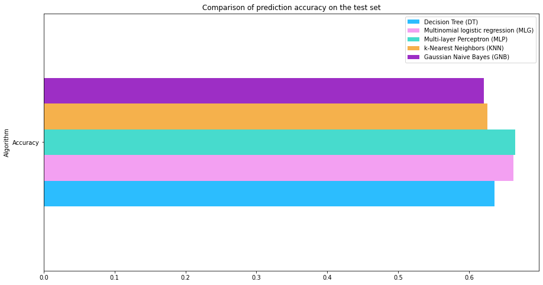
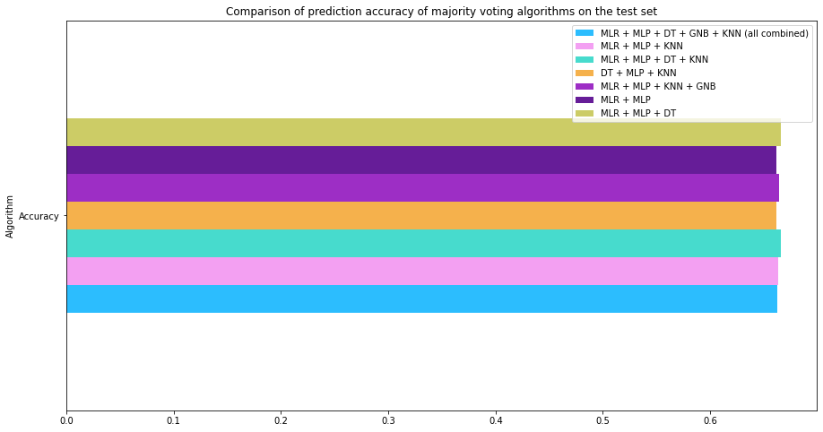
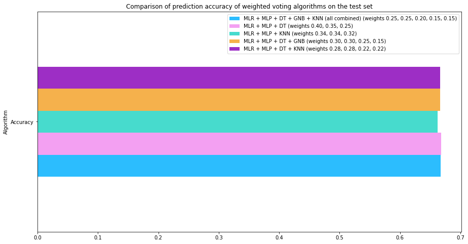

# ensemble-learning-football-predictor


 


<p align="center"> </p>

## Project's purpose
**Why? What's new introduced?**

☑️ Classic models often turn out to be inefficient in the specifics of football prediction, especially in predicting draw results

☑️ In this area, there is a lot of space for further search for increasingly optimal solutions


**Main goals**

🎯 Test Ensemble learning technique in the specificity of football prediction

🎯 Combine several individual models to produce more accurate predictions than a single model alone

🎯 Compare efficiency of ensemble predictors vs individual ones

🎯 Searching for the optimal predictor and build it as strong as possible

**To-do**

💡 adding some descriptions and results interpretations to main file


<p align="center"> </p>

## Description

The project presents several machine learning approaches to predicting football match results. The focus is on the games of 4 major football leagues - English, Spanish, German and Italian, from a period of about 10 seasons. The main point of the research was the construction of ensemble learning algorithms (voting, boosting, bagging), but classic single models of multi-class prediction and binary classification were also presented. Mainly for the purpose of comparing the obtained results and trying to better understand and explain of the complexity of predicting football events.

🔥 4 top leagues

🔥 more than 18 000 matches from 13 seasons (2010/11 - 2022/23)

🔥 more than 20 separate machine learning algorithms

**Data source:** https://football-data.co.uk

## Content


**Individual algorithms:**

◾ Decision Tree (DT)

◾ Multinomial logistic regression (MLG)

◾ Multi-layer Perceptron (MLP)

◾ k-Nearest Neighbors (KNN)

◾ Gaussian Naive Bayes (GNB)

**Ensemble algorithms:**

◾ Random forest - as example of the bagging method

◾ XGBoost - as example of the boosting method

◾ Majority Voting Algortihms

◾ Weighted Voting Algortihms

**Binary classificator:**

◾ Random forest


✅ For each of the above algorithms, the GridSearch method was used to search for a set of optimal hyperparameters.


a little teaser below..






## Built with

**Tech:** Python language with the following libraries

🔧 Pandas 🔧 Numpy 🔧 GridSearchCV 🔧 Scikit-learn 🔧 Seaborn 🔧 XGBoost 🔧 Plotnine 🔧 Matplotlib   

versions of some python libraries available in 'requirements.txt' file

## Run

Clone repository

```
$ git clone https://github.com/pawelp0499/ensemble-learning-football-predictor.git
```

Choose correct directory

```
$ cd ensemble-learning-football-predictor
```

All content in .ipynb file

```
main.ipynb
```

## Icons

<a href="https://www.flaticon.com/free-icons/plan" title="plan icons">Plan icons created by Freepik - Flaticon</a>

<a href="https://www.flaticon.com/free-icons/stadium" title="stadium icons">Stadium icons created by Freepik - Flaticon</a>


Copyright (c) 2024 Paweł Pechta